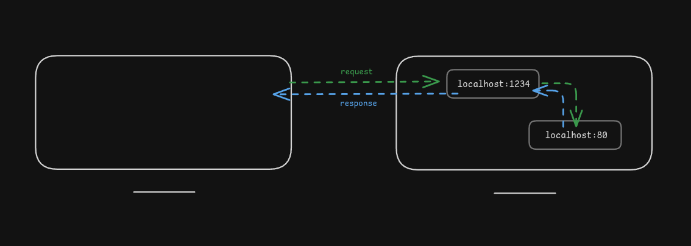

## Simple HTTP proxy

Requires Node >= 22.0

```bash
node proxy \
    --from localhost:1234 --to localhost:80 --host dave.dev --accept application/json \
    --from localhost:4567 --to localhost:80 --authorization "Bearer e1b42860" --x-custom-header MyValue
```

A request to `http://localhost:1234/` will be forwarded to `http://localhost:80/` with the `Host` header set to `dave.dev` and the `Accept` header set to `application/json`.

> Note: If the original request did not have the headers, they will be added. If they did, they will be overwritten.


